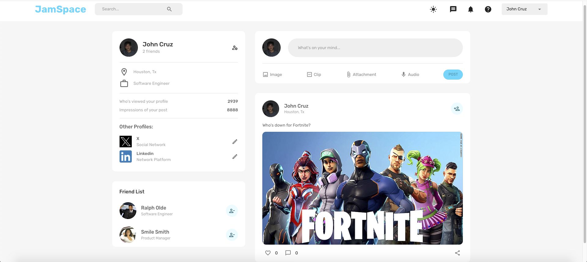

# Social Net

This project is a full-fledged social media application built using the MERN (MongoDB, Express.js, React, Node.js) stack. It includes user authentication, post creation, liking posts, and dark mode features.

## Table of Contents

- [Features](#features)
- [Screenshot](#screenshot)
- [Technologies](#technologies)

## Features

- User authentication (JWT)
- Create, edit, and delete posts
- Like and comment on posts
- Dark mode toggle
- Responsive design
- Image uploads
- Real-time updates

## Screenshot

Here is a screenshot of how the application looks:

## Technologies

- **Frontend:** React, Redux Toolkit, React Router, Formik, Yup, Material-UI, React Dropzone
- **Backend:** Node.js, Express.js, Mongoose
- **Database:** MongoDB
- **Authentication:** JWT
- **File Uploads:** Multer